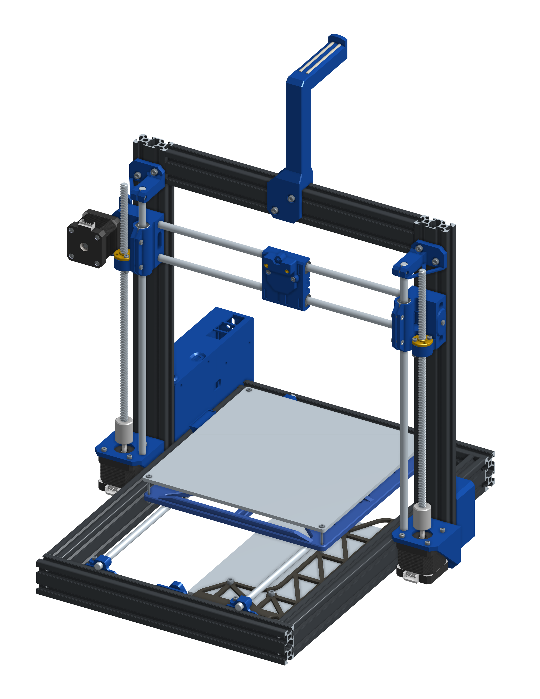

# Moron i3
A capable i3 style bedslinger, packed with features, but kept at a reasonable cost

## Introduction
Back in 2013 I saved up some money and bought my first 3D printer. It was a CTC-i3,
a prusa i3 wannabe, with a wooden frame and terrible construction in today's standards
Recently I was cleaning up in the garage and found it again after about 7 years of
collecting dust. The frame dried out and warped, rigidity was long gone.
I didn't want to get rid of it, since it still had working motors,
and great bearings on linear rods, a titan extruder on great condition, etc...
I just wanted to give it a second life.

First I was only going to make a new frame for it and get it in a working order.
Along the way I came across a few things I never liked on this printer, like the
wide toolhead, and the space wasted by the poor design choices of CTC.

Then I found out it's sister model, the also very popular for its low price Anet A8
had a project to replace its acrylic frame with a 2040 extrusion frame. Inspired
by that I started redesigning the whole thing from scratch. Then scope creep kicked
in, so now it's a klipperized bedslinger with ABL and a CANbus toolhead...

Why "Moron"? I also took a lot of inspiration from Voron Design's fine work, but
obviously can't call this a Voron. My name is Mihály. Mihály's Voron. Moron.
(And I happen to be a moron sometime...)

## Buid
This printer is made of self sourced, and prepared parts. For a (mostly) complete
list, check out the [BOM](Doc/BOM.md).

If you're done sourcing parts, you can start assembly using the [Guide](Doc/Guide.md)

## Footnote
This printer design is free to download and tinker with, and always will be.

However, if you feel it gave you some value, please support the project by donating
2-5$ on one of these channels

| [Ko-Fi   ](https://ko-fi.com/Q5Q414JWQD) | [Revolut   ](https://revolut.me/mihlywer) | [Paypal   ](https://paypal.me/rozzy87) |
|---|---|---|

